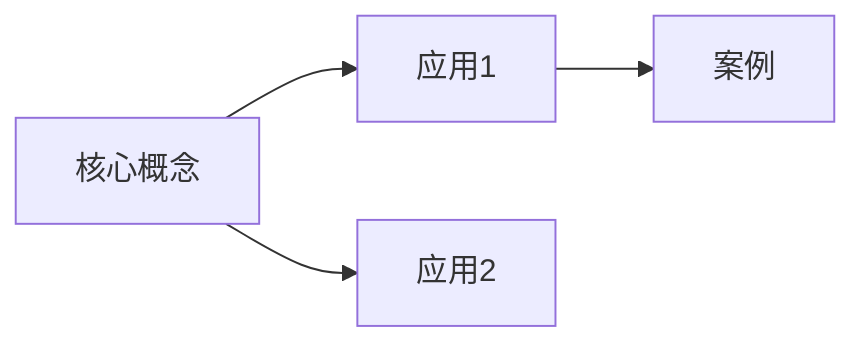

# 📖 《{{title}}》读书笔记

## 📚 图书信息

**书名**: 
**作者**: 
**出版社**: 
**ISBN**: 
**阅读章节**: 第  章

## 🎯 阅读目的

- 
- 

## 📝 内容摘要

### 本章主题

### 核心观点

1. 
2. 
3. 

## 💡 金句摘录

> 

> 

> 

## 🤔 个人思考

### 启发点
- 

### 疑问
- 

### 与已知知识的联系
- [[]]

## 🔍 深入分析

### 作者论证逻辑

### 支撑证据

### 可能的反驳

## 📊 知识图谱

## ✏️ 实践应用

### 可以应用的场景
1. 
2. 

### 行动计划
- [ ] 
- [ ] 

## 🔗 相关阅读

- [[]]
- [[]]

## 📈 阅读进度

阅读时长:: 分钟
理解程度:: /10
推荐指数:: ⭐⭐⭐⭐⭐

---
开始阅读:: 
完成阅读:: 
阅读状态:: 📖 阅读中

#publish
